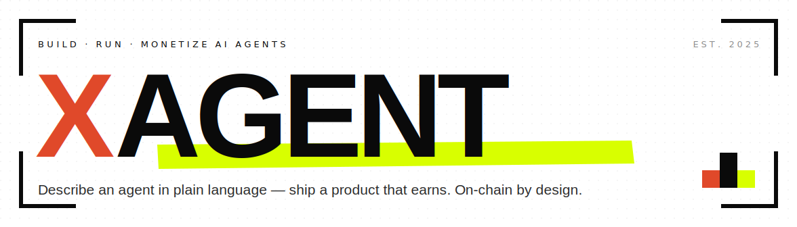

  

  
  
  
  
  

  <b>Build, run &amp; monetize AI agents.</b> 
  Describe an agent in plain language — get a working product you can publish and monetize. 
  On-chain by design.

  <a href="https://xagt.ai"><b>xagt.ai</b></a>
  &nbsp;·&nbsp;
  <a href="https://docs.xagt.ai">Docs</a>
  &nbsp;·&nbsp;
  <a href="https://x.com/XAgent_official">@XAgent_official</a>

---

### What is XAgent?

XAgent turns an idea **described in plain language** into a working AI agent or AI‑powered web app — then helps you **run, publish, and monetize** it. Agents can act, remember context, connect to tools and wallets, and settle payments on‑chain via **x402**. Not a prototype toy — a hosted product you and your users can actually use.

<table>
  <tr>
    <td width="25%"><b>✍&nbsp; Builder</b> Describe an agent in natural language → a functioning product, not just a prototype.</td>
    <td width="25%"><b>⚙&nbsp; Runtime</b> Agents that act, remember context, and connect to tools &amp; wallets.</td>
    <td width="25%"><b>◈&nbsp; Marketplace</b> Publish &amp; share agents so others can discover and use them.</td>
    <td width="25%"><b>◎&nbsp; Monetization</b> Package workflows into paid products — settled on‑chain via x402.</td>
  </tr>
</table>

### Projects

| Repo | What it is | |
| :--- | :--- | :--- |
| [**xagent**](https://github.com/xerpa-ai) | Agent builder + runtime · plain language → product | `public` |
| [**xerness**](https://github.com/xerpa-ai/Xerness) | Multi‑agent orchestration infra · requirements → agents → runnable code | `open core` |
| [**xpense**](https://github.com/xagent-labs/xpense) | Payments SDK for AI agents · budgets, approvals, x402 | `public` |
| [**xagt-plugin**](https://github.com/xagent-labs/xagt-plugin) | OKX Agentic Wallet plugin marketplace | `public` |
| [**okx-agent-marketplace**](https://github.com/xagent-labs/okx-agent-marketplace) | First‑party on‑chain intelligence skills | `public` |
| **xagent-contracts** | On‑chain contracts · audited &amp; verified | `public` |

### Documentation

Step‑by‑step guides &amp; tutorials at **[docs.xagt.ai](https://docs.xagt.ai)**

`01` Getting started &nbsp;·&nbsp; `02` Build your first agent &nbsp;·&nbsp; `03` Payments &amp; x402 settlement &nbsp;·&nbsp; `04` Publish &amp; monetize

### Find us

**[xagt.ai](https://xagt.ai)** &nbsp;·&nbsp; **X** [@XAgent_official](https://x.com/XAgent_official)

Building since 2025. Full private commit history is available to partners &amp; auditors under NDA.
