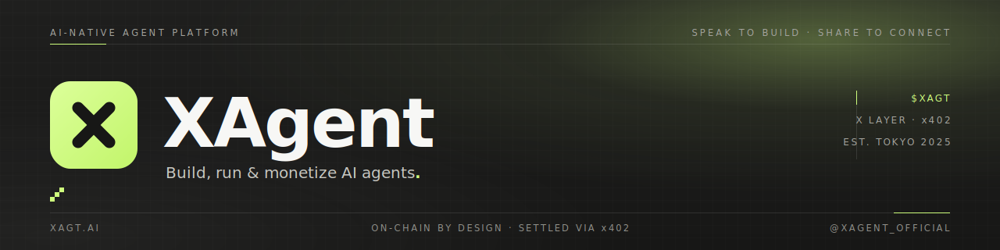

  

  
  
  
  
  

  <b>Build, run &amp; monetize AI agents.</b> 
  Describe an agent in plain language — get a working product you can publish and monetize. 
  Speak to build · Share to connect

  <a href="https://xagt.ai"><b>xagt.ai</b></a>
  &nbsp;·&nbsp;
  <a href="https://docs.xagt.ai">Docs</a>
  &nbsp;·&nbsp;
  <a href="https://x.com/XAgent_official">@XAgent_official</a>

<code>·&nbsp;·&nbsp;·&nbsp;·&nbsp;·&nbsp;·&nbsp;·&nbsp;·&nbsp;·&nbsp;·&nbsp;·&nbsp;·&nbsp;·&nbsp;·&nbsp;·&nbsp;·&nbsp;·&nbsp;·&nbsp;·&nbsp;·&nbsp;·&nbsp;·&nbsp;·&nbsp;·&nbsp;·&nbsp;·&nbsp;·&nbsp;·&nbsp;·&nbsp;·</code>

## `01` &nbsp; What is XAgent

XAgent turns an idea **described in plain language** into a working AI agent — then helps you **run, publish, and monetize** it. You describe what the agent should do; XAgent gives you back a functioning, hosted product, not a prototype toy. Agents can act, remember context, connect to tools and wallets, and settle payments on‑chain via **x402**.

It's a product, not a coding project. You speak; XAgent builds.

<table>
  <tr>
    <td width="25%" valign="top"><b>✍&nbsp; Builder</b> Describe an agent in natural language → a functioning product, not just a prototype.</td>
    <td width="25%" valign="top"><b>⚙&nbsp; Runtime</b> Agents that act, remember context, and connect to tools &amp; wallets.</td>
    <td width="25%" valign="top"><b>◈&nbsp; Marketplace</b> Publish &amp; share agents so others can discover and use them.</td>
    <td width="25%" valign="top"><b>◎&nbsp; Monetization</b> Package workflows into paid products — settled on‑chain via x402.</td>
  </tr>
</table>

## `02` &nbsp; How it works

<table>
  <tr>
    <td width="33%" valign="top"><b>01 &nbsp; SPEAK</b> Describe the agent you want in plain language — its job, its tools, how it should behave.</td>
    <td width="33%" valign="top"><b>02 &nbsp; BUILD</b> XAgent turns the description into a working, hosted agent you can use right away.</td>
    <td width="33%" valign="top"><b>03 &nbsp; SHARE</b> Publish it, let others use it, and monetize the workflows — settled on‑chain.</td>
  </tr>
</table>

## `03` &nbsp; Projects

| Project | What it is | |
| :--- | :--- | :--- |
| [**xagent**](https://github.com/xagent-labs/xagent) | The product — describe an agent in plain language, get a working, hosted agent |  |
| [**xerness**](https://github.com/xagentAI/xerness-intro) | Multi‑agent orchestration infra · requirements → agents → runnable code |  |
| [**xpense**](https://github.com/xagent-labs/xpense) | Payments toolkit that powers agent budgets, approvals &amp; x402 settlement |  |
| [**xagt-plugin**](https://github.com/xagent-labs/xagt-plugin) | OKX Agentic Wallet plugin marketplace |  |
| **okx-agent-marketplace** | First‑party on‑chain intelligence skills |  |
| [**xagent-contracts**](https://github.com/xagentAI/xagent-contracts) | On‑chain reward‑point contracts · XPoint ERC‑20 + EIP‑712 check‑in on X Layer |  |

xpense, xagt-plugin &amp; the contracts are supporting pieces that make the product work — the headline is XAgent itself.

## `04` &nbsp; Activity

Live signal from our public repositories — language, last commit, and monthly commit activity.

| Repository | Stack | Pulse | ★ |
| :--- | :--- | :--- | :--- |
| [xagent-contracts](https://github.com/xagentAI/xagent-contracts) |  |   |  |
| [ui-design](https://github.com/xagentAI/ui-design) |  |   |  |
| [e2b-go](https://github.com/xagentAI/e2b-go) |  |   |  |
| [xerness-intro](https://github.com/xagentAI/xerness-intro) |  |   |  |

Badges are live — they refresh from GitHub every time this page loads. Most engineering happens in private repos; public commit history is a partial view.

## `05` &nbsp; Documentation

Guides &amp; tutorials at **[docs.xagt.ai](https://docs.xagt.ai)** — getting started, building agents, publishing &amp; monetizing, and how x402 settlement works.

## `06` &nbsp; Find us

**[xagt.ai](https://xagt.ai)** &nbsp;·&nbsp; **X** [@XAgent_official](https://x.com/XAgent_official) &nbsp;·&nbsp; **Tokyo, JP**

<code>·&nbsp;·&nbsp;·&nbsp;·&nbsp;·&nbsp;·&nbsp;·&nbsp;·&nbsp;·&nbsp;·&nbsp;·&nbsp;·&nbsp;·&nbsp;·&nbsp;·&nbsp;·&nbsp;·&nbsp;·&nbsp;·&nbsp;·&nbsp;·&nbsp;·&nbsp;·&nbsp;·&nbsp;·&nbsp;·&nbsp;·&nbsp;·&nbsp;·&nbsp;·</code>

Building since 2025 · Speak to build, share to connect · Settled on‑chain via x402

