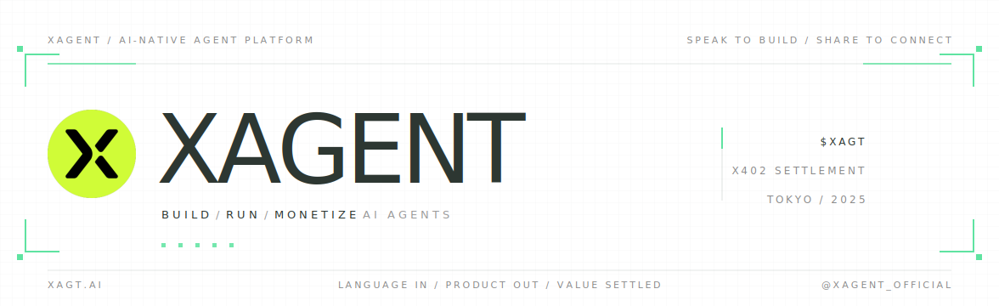
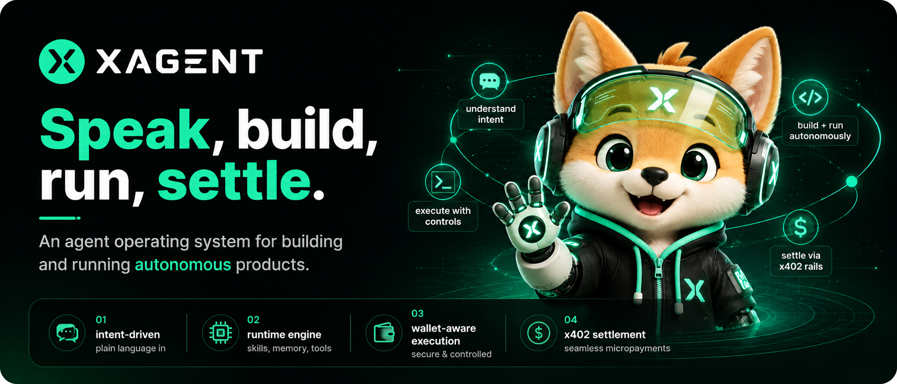
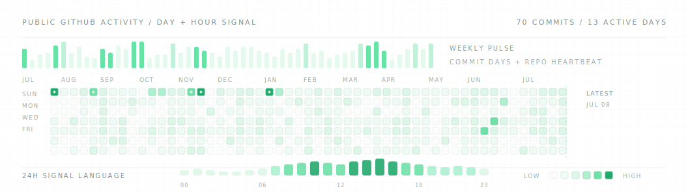

  

  <a href="https://xagt.ai"><b>xagt.ai</b></a>
  &nbsp;/&nbsp;
  <a href="https://docs.xagt.ai">docs</a>
  &nbsp;/&nbsp;
  <a href="https://x.com/XAgent_official">@XAgent_official</a>

  

  <b>Speak an agent into shape. Ship it as a product.</b> 
  XAgent, also written X-Agent, is an AI agent builder, hosted agent runtime, agent marketplace, and agentic payments platform for teams shipping agent-powered software.

 

## Operating System for Agentic Products

XAgent is the product and runtime layer for agents that need to move beyond chat: specification, execution, tool access, account context, marketplace distribution, and x402 settlement live inside one coordinated system.

The platform is built as a four-plane architecture:

- **Intent plane**: natural language becomes structured agent requirements, product flows, skills, and executable plans.
- **Runtime plane**: hosted agents act with memory, tools, wallets, account connections, queues, and auditable execution state.
- **Distribution plane**: agents and skills can be published, installed, shared, and surfaced through marketplace channels.
- **Settlement plane**: usage, budgets, approvals, rewards, and on-chain settlement are treated as first-class product primitives.

## System Surface

XAgent is designed as a product stack, not a single repository. The public surface explains the product; the open repositories expose the reusable rails; the private core carries orchestration, runtime coordination, and launch-critical infrastructure.

| Layer | Role |
| --- | --- |
| Product | `xagt.ai` entry point, builder flow, public agent surface |
| Runtime | hosted execution, memory, tools, accounts, wallets |
| Commerce | budgets, approvals, x402 settlement, marketplace monetization |
| Protocol | contracts, reward points, wallet/plugin integrations |

## Product Matrix

| Repo | What | Access |
| --- | --- | --- |
| [xagt.ai](https://xagt.ai) | Public product surface · agent builder + hosted runtime | public |
| [xerness-intro](https://github.com/xagentAI/xerness-intro) | Multi-agent orchestration infrastructure · open core overview | public |
| [docs](https://docs.xagt.ai) | Tutorials, guides, and product documentation | public |
| [xpense](https://github.com/xagentAI/xpense) | Agent payments SDK · budgets, approvals, x402 settlement | public |
| [xagt-plugin](https://github.com/xagentAI/xagt-plugin) | OKX Agentic Wallet plugin marketplace surface | public |
| [xagent-contracts](https://github.com/xagentAI/xagent-contracts) | On-chain contracts for reward points and usage flows | public |
| [OKX Agent Marketplace](https://www.okx.ai/zh-hans/agents/2183) | Live marketplace listing for on-chain intelligence skills | live service |
| [okx-agent-marketplace](https://github.com/xagentAI/okx-agent-marketplace) | First-party on-chain intelligence skills and partner integrations | private |
| XAgent core · orchestrator | Builder pipeline, runtime coordination, billing, and infra | private · NDA |

## How It Works

  

## Activity

  

## Find Us

**Website** [xagt.ai](https://xagt.ai) &nbsp;/&nbsp; **Docs** [docs.xagt.ai](https://docs.xagt.ai) &nbsp;/&nbsp; **X** [@XAgent_official](https://x.com/XAgent_official)

Building from Tokyo since 2025. Private commit history can be made available to partners and auditors under NDA.
