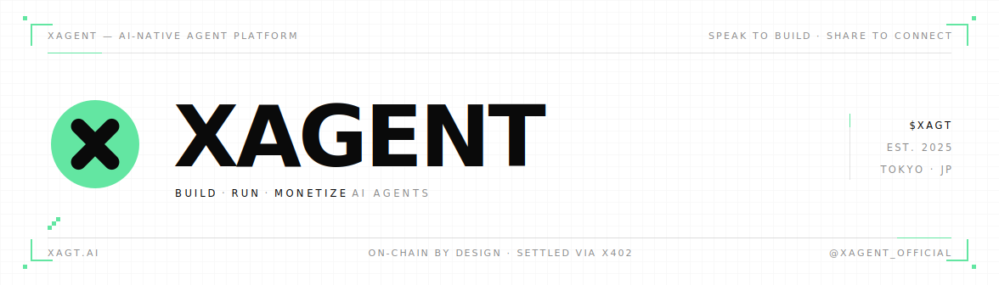

  

  
  
  
  
  

  <b>Build, run &amp; monetize AI agents.</b> 
  Describe an agent in plain language — get a working product you can publish and monetize. 
  Speak to build. Share to connect.

  <a href="https://xagt.ai"><b>xagt.ai</b></a>
  &nbsp;·&nbsp;
  <a href="https://docs.xagt.ai">Docs</a>
  &nbsp;·&nbsp;
  <a href="https://x.com/XAgent_official">@XAgent_official</a>

<code>·  ·  ·  ·  ·  ·  ·  ·  ·  ·  ·  ·  ·  ·  ·  ·  ·  ·  ·  ·  ·  ·  ·  ·  ·  ·  ·  ·  ·  ·  ·  ·</code>

## `01` &nbsp; What is XAgent

XAgent turns an idea **described in plain language** into a working AI agent — then helps you **run, publish, and monetize** it. You describe what the agent should do; XAgent gives you back a functioning, hosted product, not a prototype toy. Agents can act, remember context, connect to tools and wallets, and settle payments on‑chain via **x402**.

It's a product, not a coding project. You speak; XAgent builds.

<table>
  <tr>
    <td width="25%"><b>✍&nbsp; Builder</b> Describe an agent in natural language → a functioning product, not just a prototype.</td>
    <td width="25%"><b>⚙&nbsp; Runtime</b> Agents that act, remember context, and connect to tools &amp; wallets.</td>
    <td width="25%"><b>◈&nbsp; Marketplace</b> Publish &amp; share agents so others can discover and use them.</td>
    <td width="25%"><b>◎&nbsp; Monetization</b> Package workflows into paid products — settled on‑chain via x402.</td>
  </tr>
</table>

## `02` &nbsp; How it works

<table>
  <tr>
    <td width="33%" valign="top"><b>SPEAK</b> Describe the agent you want in plain language — its job, its tools, how it should behave.</td>
    <td width="33%" valign="top"><b>BUILD</b> XAgent turns the description into a working, hosted agent you can use right away.</td>
    <td width="33%" valign="top"><b>SHARE</b> Publish it, let others use it, and monetize the workflows — settled on‑chain.</td>
  </tr>
</table>

## `03` &nbsp; Projects

| Repo | What it is | |
| :--- | :--- | :--- |
| [**xagent**](https://github.com/xerpa-ai) | The product — describe an agent in plain language, get a working, hosted agent | `public` |
| [**xerness**](https://github.com/xerpa-ai/Xerness) | Multi‑agent orchestration infra · requirements → agents → runnable code | `open core` |
| [**xpense**](https://github.com/xagent-labs/xpense) | Payments toolkit that powers agent budgets, approvals &amp; x402 settlement | `public` |
| [**xagt-plugin**](https://github.com/xagent-labs/xagt-plugin) | OKX Agentic Wallet plugin marketplace | `public` |
| [**okx-agent-marketplace**](https://github.com/xagent-labs/okx-agent-marketplace) | First‑party on‑chain intelligence skills | `public` |
| **xagent-contracts** | On‑chain contracts · audited &amp; verified | `public` |

xpense and xagt-plugin are supporting pieces that make the product work — the headline is XAgent itself.

## `04` &nbsp; Documentation

Guides &amp; tutorials at **[docs.xagt.ai](https://docs.xagt.ai)** — getting started, building agents, publishing &amp; monetizing, and how x402 settlement works.

## `05` &nbsp; Find us

**[xagt.ai](https://xagt.ai)** &nbsp;·&nbsp; **X** [@XAgent_official](https://x.com/XAgent_official) &nbsp;·&nbsp; **Tokyo, JP**

<code>·  ·  ·  ·  ·  ·  ·  ·  ·  ·  ·  ·  ·  ·  ·  ·  ·  ·  ·  ·  ·  ·  ·  ·  ·  ·  ·  ·  ·  ·  ·  ·</code>

Building since 2025. Full private commit history is available to partners &amp; auditors under NDA.
